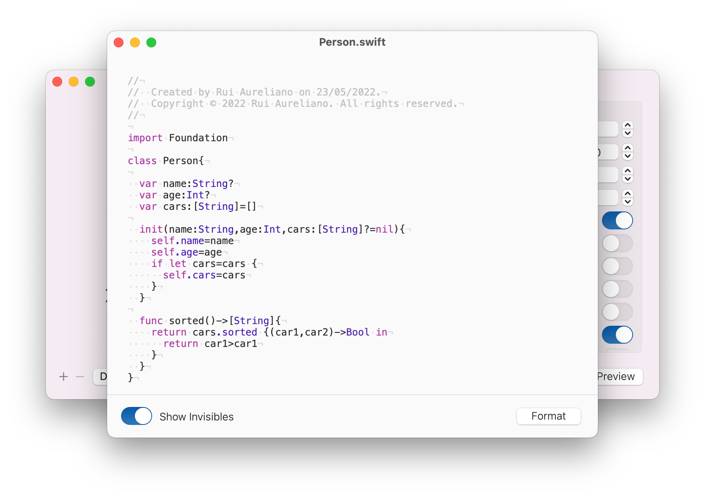
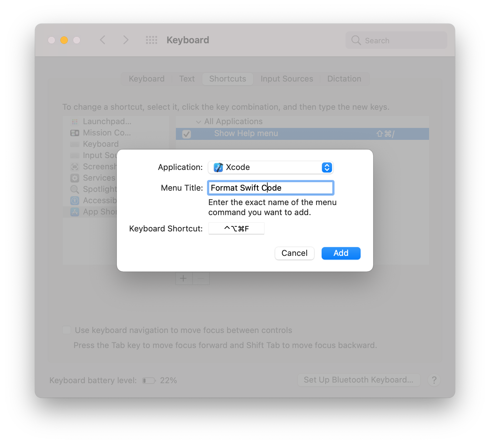

# 🛠 X-SwiftFormat 

[](./LICENSE.md) [](https://swift.org/blog/swift-5-6-released/) [](./DOCS.md)


## Installation

### Using Github

[](https://github.com/ruiaureliano/X-SwiftFormat/releases/download/1.2/x-swiftformat_1.2.zip)

### Using Cask

 `brew install --cask x-swiftformat`

## Usage

### 1) Open X-SwiftFormat

**X-SwiftFormat** works as Xcode Extension to format your swift code. You will need to open this once to activate it 👍


**a)** You case use the **Preview** to see the format running in the app 💪



**b)** You can export a configuration file ( `.swift-format` ) to use later 🖥

### 2) Enable X-SwiftFormat

Open **System Preferences** ▸ **Extensions** ▸ **Xcode Source Editor** and make sure **X-SwiftFormat** is selected ✅


### 3) Use X-SwiftFormat

Open Xcode and use the **Format Swift Code** command in Xcode's **Editor** menu 🚀


### 4) Add X-SwiftFormat Shortcut

Open **System Preferences**, click on **Keyboard** and switch to the **Shortcuts** tab. Select **App Shortcuts**, then hit the <kbd>+</kbd> button. Select **Xcode**, enter `Format Swift Code` and set your **Shortcut**.👏



---

# Installing [Apple Swift Format](https://github.com/apple/swift-format) (Xcode or Mint)

## a) Using Xcode

if you are using **Xcode 13.4 (Swift 5.6)**, you can check out and build swift-format using the following commands:

```
git clone -b release/5.6 https://github.com/apple/swift-format.git
cd swift-format
swift build
```

You should see this

```
Build complete! (51.82s)
```

👍👍👍

## b) Using Mint 

If you dint have **Homebrew**, install [here](https://brew.sh)

```
brew install mint
mint install apple/swift-format@release/5.6
```

You should see this

```
🌱 Cloning swift-format release/5.6
🌱 Resolving package
🌱 Building package
🌱 Installed swift-format release/5.6
🌱 Linked swift-format release/5.6
```

👍👍👍

### Command Line Usage

```
swift-format -v
0.50600.1
```

|Command | Description |
|-|-|
| `swift-format swift` |Display formatted code|
| `swift-format -i file.swift` |Overwrites formatted code|
| `swift-format -r folder` |Format all files in a folder|
| `swift-format -r -i folder` |Format all files in a folder and overwrites|

Check more info here: [https://github.com/apple/swift-format](https://github.com/apple/swift-format)

---

I'm [Rui Aureliano](http://ruiaureliano.com), iOS and macOS Engineer at [Olá Brothers](https://theolabrothers.com). We make [Sip](https://sipapp.io) 🤓

[Linkedin](https://www.linkedin.com/in/ruiaureliano) | [AngelList](https://angel.co/ruiaureliano) | [Twitter](https://twitter.com/ruiaureliano) | [Github](https://github.com/ruiaureliano) | [Medium](https://medium.com/@ruiaureliano) | [Stackoverflow](https://stackoverflow.com/users/881095/ruiaureliano)
