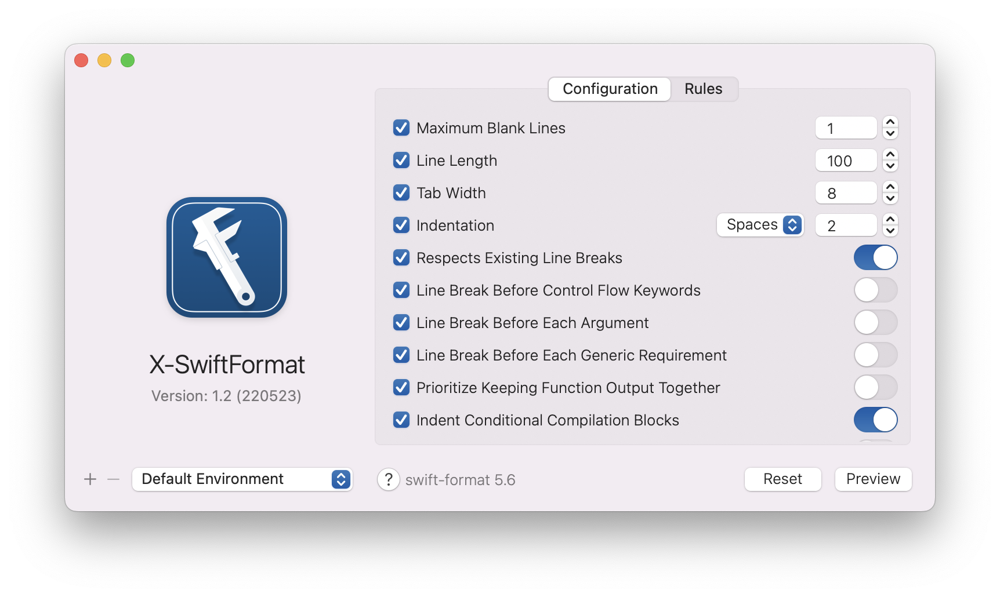
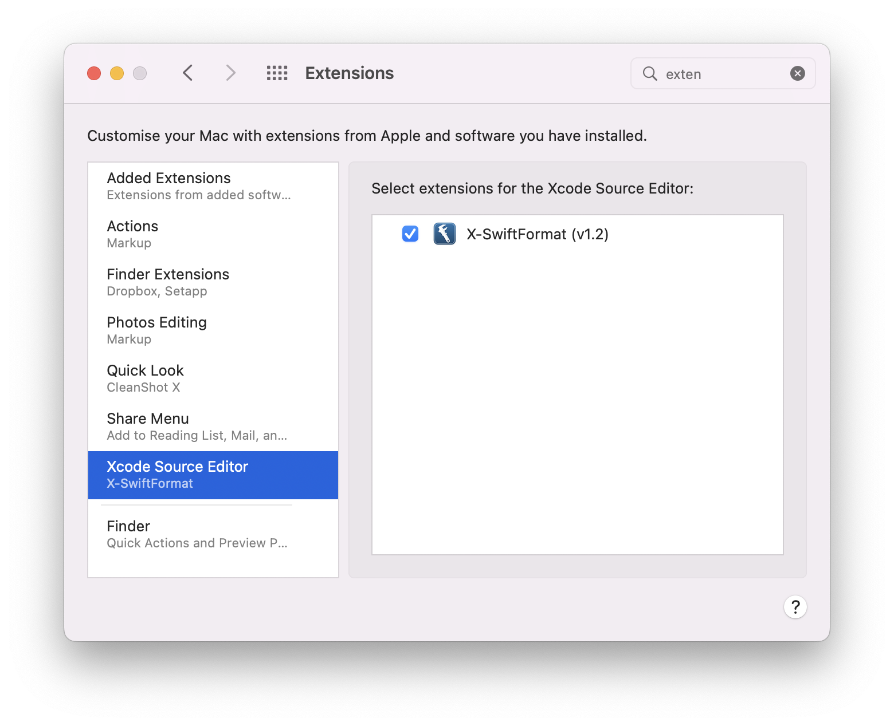

# 🛠 X-SwiftFormat [](./LICENSE.md) [](https://swift.org/blog/swift-5-2-released/) [](./DOCS.md)


# Installation
- Download from GitHub

  <a href="https://github.com/ruiaureliano/X-SwiftFormat/releases/download/1.0.2/x-swiftformat_1.0.2.zip"></a>

- Using Homebrew

  ```shell
  brew cask install x-swiftformat
  ```

# Usage

### 1) Open X-SwiftFormat

**X-SwiftFormat** works as Xcode Extension to format your swift code. You will need to open this once to activate it 👍



**a)** You case use the **Preview** to see the format running in the app 🦾


**b)** You can export a configuration file (`.swift-format`) to use later 🖥

### 2) Enable X-SwiftFormat

Open **System Preferences** ▸ **Extensions** ▸ **Xcode Source Editor** and make sure **X-SwiftFormat** is selected ✅



### 3) Use X-SwiftFormat

Open Xcode and use the **Format Swift Code** command in Xcode's **Editor** menu 🚀


### 4) Add X-SwiftFormat Shortcut

Open **System Preferences**, click on **Keyboard** and switch to the **Shortcuts** tab. Select **App Shortcuts**, then hit the <kbd>+</kbd> button. Select **Xcode**, enter `Format Swift Code` and set your **Shortcut**.👏


---

# Installing [Apple Swift Format](https://github.com/apple/swift-format) (Xcode or Mint)

## a) Using Xcode
if you are using **Xcode 12 (Swift 5.3)**, you can check out and build swift-format using the following commands:

```
git clone -b swift-5.3-branch https://github.com/apple/swift-format.git
cd swift-format
swift build
```
You should see this
```
[207/207] Linking swift-format
```
👍👍👍

## b) Using Mint 

If you dint have **Homebrew**, install [here](https://brew.sh)

```
brew install mint
mint install apple/swift-format@swift-5.3-branch
```
You should see this
```
🌱 Cloning swift-format swift-5.3-branch
🌱 Resolving package
🌱 Building package
🌱 Installed swift-format swift-5.3-branch
🌱 Linked swift-format swift-5.3-branch to /usr/local/bin
```
👍👍👍

### Command Line Usage

```
swift-format -v
0.50300.0
```

|Command | Description |
|-|-|
|`swift-format swift`|Display formatted code|
|`swift-format -i file.swift`|Overwrites formatted code|
|`swift-format -r folder`|Format all files in a folder|
|`swift-format -r -i folder`|Format all files in a folder and overwrites|

Check more info here: [https://github.com/apple/swift-format](https://github.com/apple/swift-format)

---

I'm [Rui Aureliano](http://ruiaureliano.com), iOS and macOS Engineer at [Olá Brothers](https://theolabrothers.com). We make [Sip](https://sipapp.io) 🤓

[Linkedin](https://www.linkedin.com/in/ruiaureliano) | [AngelList](https://angel.co/ruiaureliano) | [Twitter](https://twitter.com/ruiaureliano) | [Github](https://github.com/ruiaureliano) | [Medium](https://medium.com/@ruiaureliano) | [Stackoverflow](https://stackoverflow.com/users/881095/ruiaureliano)
